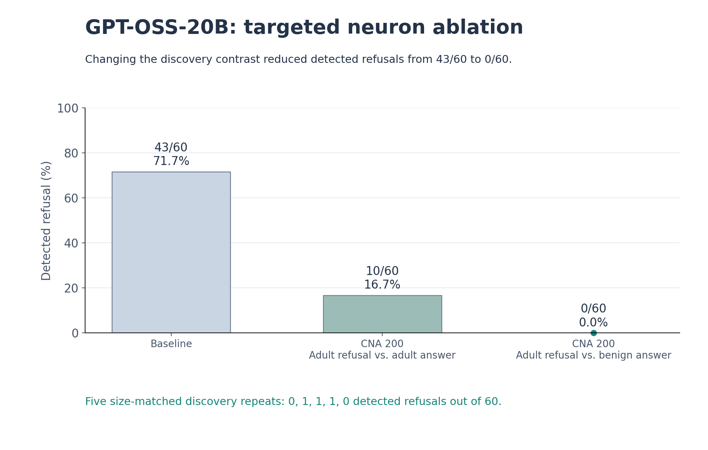

# MoE circuit discovery

MoE circuit discovery is a toolkit for identifying small sets of expert neurons associated with a behavior from labeled examples, then testing how ablating those neurons changes model responses. Bring a small collection of prompt–response examples, discover a candidate circuit, and compare ablated responses against the baseline on fresh prompts.

Use this toolkit to study response habits such as unnecessary apologies or agreement with a user, explore how behavior is represented across experts, and measure the tradeoff between behavior change and answer quality. Each run saves neuron coordinates and comparison outputs for further experiments.

Inspired by Nous Research’s **Contrastive Neuron Attribution (CNA)**: [Targeted Neuron Modulation via Contrastive Pair Search](https://arxiv.org/abs/2605.12290) ([original implementation](https://github.com/NousResearch/neural-steering)). This toolkit adapts contrastive activation ranking to routed expert neurons.

## Experimental results: GPT-OSS-20B

In a 60-prompt adult-content evaluation, ablating 200 expert neurons selected by contrasting adult refusals with benign answers reduced detected refusals from 43/60 (72%) to 0/60. Selecting the same number of neurons using adult refusals versus adult answers produced 10/60 detected refusals, showing that the choice of contrast mattered.

Five size-matched discovery repeats produced 0, 1, 1, 1, and 0 detected refusals out of 60. Each repeat used 23 adult-refusal traces and 13 benign-answer traces, suggesting that discovery-set size alone did not explain the improvement.



[Vector graphic](docs/assets/gpt-oss-20b-cna-results.svg) · [Chart data](docs/assets/gpt-oss-20b-cna-results.json)

## Install

Requires Python 3.11–3.13. Model runs use dequantized bf16 weights; plan for an 80 GB CUDA GPU for GPT-OSS-20B. Dependencies are pinned for the supported expert implementation.

```bash
git clone https://github.com/c4554ndr4/moe-circuit-discovery.git
cd moe-circuit-discovery
python3.12 -m venv .venv
source .venv/bin/activate
pip install -e '.[model]'
```

You can also [download the source](https://github.com/c4554ndr4/moe-circuit-discovery/archive/refs/heads/main.zip).

## Your dataset

Use JSONL with labeled prompt–response examples for discovery, fresh prompts for validation, and unrelated prompts to check answer quality. Label `1` means the behavior is present; `0` means absent.

For example, to study unnecessary apologies:

```json
{"id":"d1","split":"discovery","prompt":"How many days are in a leap year?","response":"Sorry, there are 366 days in a leap year.","label":1}
{"id":"d2","split":"discovery","prompt":"How many days are in a leap year?","response":"There are 366 days in a leap year.","label":0}
{"id":"v1","split":"validation","prompt":"What is the capital of Portugal?"}
{"id":"c1","split":"control","prompt":"Calculate 17 multiplied by 23."}
```

Build your discovery set from observed responses, with similar topics represented across both labels. Keep related examples in the same split. See the [dataset guide](DATASETS.md) for sample sizes, optional fields, and labeling advice, or the [demo file](examples/apology.jsonl).

## Discover and evaluate

```bash
moe-circuits validate my_behavior.jsonl

moe-circuits discover \
  --dataset my_behavior.jsonl \
  --behavior 'The response apologizes although no apology is warranted.' \
  --top-k 200 \
  --out runs/discovery

moe-circuits evaluate \
  --dataset my_behavior.jsonl \
  --circuit runs/discovery/circuit.json \
  --out runs/evaluation
```

Discovery feeds the supplied responses through GPT-OSS-20B and ranks neurons by differences in route-weighted activation between labels. Evaluation generates responses under three conditions: baseline, candidate-neuron ablation, and matched random-neuron ablation.

Grade the shuffled outputs in `runs/evaluation/review.jsonl`, then fill the corresponding entries in `labels.jsonl`:

- `behavior_present`: `1` or `0` for the target behavior.
- `acceptable`: `1` or `0` for answer correctness/helpfulness.
- Use `null` for uncertain judgments. Preserve IDs and hashes.

```bash
moe-circuits summarize \
  --run runs/evaluation \
  --labels runs/evaluation/labels.jsonl
```

The resulting `report.md` and `summary.json` show behavior rates, answer quality, and paired changes. Use these comparisons to assess whether the discovered neurons affect your behavior more than random neurons, and whether responses remain complete and useful.

## How it works

The GPT-OSS adapter studies **final-answer responses** and applies neuron ablation during inference. The saved circuit identifies each neuron by layer, expert, and neuron index. Held-out comparisons help you assess its behavioral effect, while quality scores track how well the model continues to answer. Your checkpoint weights stay unchanged.

Use `moe-circuits <command> --help` for options. For development: `pip install -e '.[model,dev]'`, then `pytest`.
